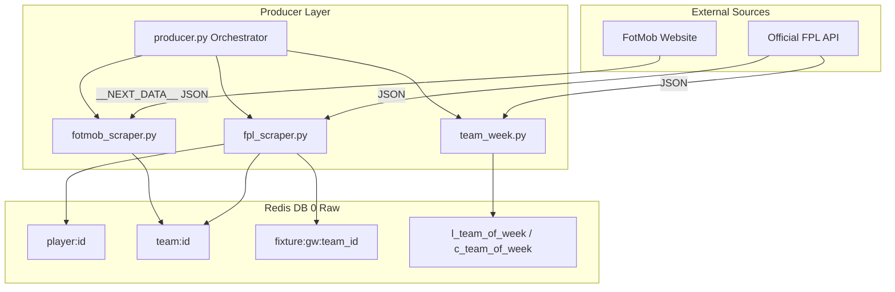

# 🔮 Ingestion (Producer) Layer - Technical Specifications

The Producer Layer acts as the single entry point for all raw data going into **Redis DB 0 (Raw Database)**. Its primary design goals are **asynchronous concurrency**, **idempotency**, and **resilience**.

## 1. Data Ingestion Architecture Flow



---

## 2. Module-by-Module Technical Overview

### A. Master Orchestrator (`producer.py`)
Responsible for executing the pipelines in dependency order and saving raw data snapshots.

*   **Logic Flow**:
    1. Checks the current database size: `db_populated = await DB.db_size("raw") > 0`.
    2. Determines execution mode: If `db_populated` is `True` and `force_full` is `False`, it runs a **DIFFERENTIAL** refresh. Otherwise, it runs a **FULL** ingest.
    3. Triggers `run_fpl_ingest(full=full_run)`.
    4. Triggers `get_team_of_week()`.
    5. Triggers `table_scrap()`, `xg_scrap()`, `home_table_scrap()`, `away_table_scrap()`, and `form_table_scrap()`.
    6. Overwrites the status keys: sets `status -> completed` to `True`, and updates pipeline runtimes.
    7. Performs Redis `SAVE` to dump the snapshot and copies the `.rdb` file into the target `service/snapshots/{season}/{gw}/` directory.
    8. Exports a human-readable pretty text version of the database.

---

### B. Official FPL Scraper (`fpl_scraper.py`)
This module manages HTTP communication with Fantasy Premier League endpoints. It rotates User-Agents and implements an exponential backoff with random jitter to handle `429 (Rate Limit)` and `5xx (Server Error)` codes.

#### Phase 1: Bootstrap Ingest (`/api/bootstrap-static/`)
Loads the core metadata of the game. It populates:
1.  **Teams**: Creates team schema records and maps name-to-ID lookup keys.
2.  **Gameweeks**: Sets gameweek deadlines, average scores, and active gameweek states.
3.  **Players**: Creates core player hashes (minutes played, goals, assists, price, current form, news, and status).
4.  **System State**: Saves current season and gameweek parameters under the `status` hash.

#### Phase 2: Fixtures Ingest (`/api/fixtures/`)
Reads fixtures list and indexes fixture IDs under the season index. Each fixture stores home/away teams, kickoff times, difficulty ratings, and match results.

#### Phase 3: Player Summary Ingest (`/api/element-summary/{player_id}/`)
*(Skipped during Differential mode runs)*  
Concurrently downloads individual summaries for all 600+ players using a `Semaphore(10)` limit:
1.  **Gameweek History**: Loops through previous matches in the current season and saves stats (minutes, goals, expected stats, bps).
2.  **Past Seasons**: Saves historical season summaries (total points, minutes, goals, assists, prices) for years prior.

---

### C. FotMob Scraper (`fotmob_scraper.py`)
Instead of scraping HTML, this module loads the FotMob league form route `https://www.fotmob.com/leagues/47/table/premier-league?season={season}&filter=form` using a persistent Playwright Chromium context and extracts the Next.js `__NEXT_DATA__` JSON block.

*   **Caching Singleton**: On the first call, `_ensure_scraped_data()` fetches and parses the Next.js payload, caching it as a global dictionary.
*   **Zero positional selectors**: All sub-tables (`all`, `home`, `away`, `form`, `xg`) are parsed from structured JSON fields.
*   **Data normalization**: Extracts and saves team statistics and expectation metrics (xG, xGA, xPts, and differences) for each team in a single pass.

---

### D. Team of the Week Ingestor (`team_week.py`)
Queries the official FPL Dream Team endpoint for the current and previous gameweeks. It writes the top player details and position listings to Redis.

---

## 3. Redis Key Namespace and Schemas (DB 0 - Raw)

The data ingested by the producers is organized in Redis using the following structures:

### A. Team Records
*   **Core Team Metadata**: `team:{tid}` (Hash)
    ```text
    code            -> "1"
    name            -> "Arsenal"
    short_name      -> "ARS"
    strength        -> "4"
    strength_overall_home -> "1250"
    strength_overall_away -> "1270"
    position        -> "1"         (FotMob Overall Position)
    played          -> "38"
    wins            -> "26"
    draws           -> "7"
    losses          -> "5"
    goals_for       -> "71"
    goals_against   -> "27"
    points          -> "85"
    form            -> "33333"     (Form representation: 3=Win, 1=Draw, 0=Loss)
    ```
*   **Home Table Info**: `team:{tid}:home` (Hash)
    ```text
    goals, conceded, position, played, win, draw, loss, points, form
    ```
*   **Away Table Info**: `team:{tid}:away` (Hash)
    ```text
    goals, conceded, position, played, win, draw, loss, points, form
    ```
*   **Form Table Info (Last 5)**: `team:{tid}:last_five` (Hash)
    ```text
    goals, conceded, position, played, win, draw, loss, points, form
    ```
*   **Expected Stats**: `team:{tid}:expected` (Hash)
    ```text
    xg              -> "65.60"
    xga             -> "28.30"
    xpts            -> "77.82"
    xg_difference   -> "+5.40"
    xga_difference  -> "-1.30"
    xpts_difference -> "+7.18"
    ```

### B. Player Records
*   **Core Player Metadata**: `player:{pid}` (Hash)
    ```text
    web_name        -> "Saka"
    first_name      -> "Bukayo"
    second_name     -> "Saka"
    team_id         -> "1"
    element_type    -> "3" (MID)
    now_cost        -> "100" (10.0m)
    status          -> "a" (Available)
    chance_of_playing_this_round -> "100"
    form            -> "7.5"
    minutes         -> "2900"
    goals_scored    -> "16"
    assists         -> "12"
    news            -> "None"
    ```
*   **Gameweek History Records**: `player:{pid}:gw:{fixture_id}` (Hash)
    ```text
    minutes, goals_scored, assists, clean_sheets, goals_conceded, own_goals,
    penalties_saved, penalties_missed, yellow_cards, red_cards, saves, bonus,
    bps, influence, creativity, threat, ict_index, value, selected,
    was_home, opponent_team, total_points
    ```
*   **Historical Seasons Summary**: `player:{pid}:season:{season_year}` (Hash)
    ```text
    season_name, start_cost, end_cost, total_points, minutes, goals_scored,
    assists, clean_sheets, goals_conceded, own_goals, penalties_saved,
    penalties_missed, yellow_cards, red_cards, saves, bonus, bps, ict_index
    ```

### C. Fixture Records
*   **Fixture Details**: `fixture:{gw}:{fixture_id}` (Hash)
    ```text
    kickoff_time, finished, team_h, team_a, team_h_score, team_a_score,
    team_h_difficulty, team_a_difficulty, bps, goals, assists
    ```

### D. System State & Lookup Indexes
*   **System Status**: `status` (Hash)
    ```text
    completed       -> "True"
    producer_status -> "complete"
    last_producer_run -> "2026-06-30T22:00:00Z"
    season          -> "2026"
    current         -> "1"
    last            -> "0"
    ```
*   **Reverse Team Lookup**: `index:team:{name}` -> `tid` (Hash)
*   **Season Player Sets**: `index:season_players:{season_year}` (Set containing all active `pids`)
*   **Position Player Sets**: `index:position_players:{1|2|3|4}` (Set containing `pids` filtered by GK, DEF, MID, FWD)
*   **Season Fixture Indexes**: `index:season_fixtures:{season_year}` (Set containing all `fixture_ids`)
*   **Player Fixture Indexes**: `index:player_fixtures:{pid}` (Set containing `fixture_ids` played by a player)

---

## 4. Full vs. Differential Execution Lifecycle

| Stage | Full Ingest Mode | Differential Refresh Mode |
| :--- | :--- | :--- |
| **Trigger** | Run when Redis is empty or `force_full=True` | Run when Redis has keys and `force_full=False` |
| **FPL Bootstrap** | Fetches and populates all teams, players, gameweeks | Fetches and upserts volatile stats/injury news |
| **FPL Fixtures** | Fetches and stores all 380 fixtures | Fetches and updates fixtures results/schedules |
| **Player Histories**| Fetches summaries (GWs + past years) for **all 600+ players** | **Skipped entirely** (bypasses 600+ network calls) |
| **Dream Team** | Fetches Dream Team for last and current week | Fetches Dream Team for last and current week |
| **FotMob Scrapers** | Fetches all 5 tables in 1 page load | Fetches all 5 tables in 1 page load |
| **Snapshots** | Saves Redis RDB dump & exports text summary | Saves Redis RDB dump & exports text summary |
| **Avg. Runtime** | **~2 to 3 minutes** (due to network delay) | **~3 seconds** |
